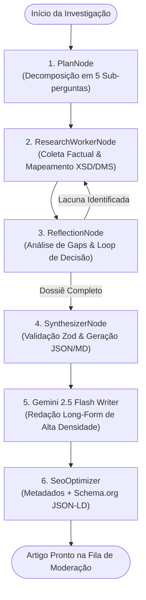

# 🧠 Auto Catálogo — AI Content Worker
> **Pipeline Autônomo de Pesquisa Profunda (Open Deep Research via LangGraph) e Redação Técnica com Google Gemini 2.5 Flash** para o Blog *Audience First* do ecossistema SaaS Auto Catálogo.

---

## 🎯 Visão Geral e Propósito de Negócio

O **AI Content Worker** é o motor de inteligência editorial da plataforma. Em vez de produzir artigos genéricos e superficiais, ele opera em **duas fases integradas**:

1. **Fase 1: Investigação Profunda Factual (Open Deep Research)**
   - Utiliza um grafo de estados cíclico em **LangGraph** (`StateGraph`) para decompor o tema em sub-perguntas investigativas (`META_API`, `DMS_TAGS`, `MARKET_BENCHMARK`, `LEAD_CONVERSION`, `SEO_INTENT`).
   - Varre e sintetiza especificações técnicas de XML do Meta Automotive Inventory Ads (DAA), tags proprietárias de integradores de estoque brasileiros (*AutoCerto, Altimus, Sisvag, BomControle, Webmotors*) e estatísticas consolidadas de mercado (Fenabrave, Webmotors).
   - Gera um **Dossiê Estruturado de Pesquisa (*Research Dossier*)** validado via Zod.

2. **Fase 2: Redação Long-Form & SEO Técnico (Gemini 2.5 Flash)**
   - Consome o *Research Dossier* como fonte de verdade primária.
   - Redige artigos aprofundados (**1.500 a 2.500+ palavras**) com tabelas comparativas de DMS, nós XML canônicos, citações de autoridade, seções de FAQ e CTAs contextuais para o Auto Catálogo SaaS.
   - Gera automaticamente metadados SEO e payloads estruturados **Schema.org JSON-LD (`Article` e `FAQPage`)** para indexação imediata com *Rich Snippets* no Google Search.

---

## 🏗️ Arquitetura do Open Deep Research com LangGraph



---

## 🛠️ Tecnologias Utilizadas

- **Runtime & Linguagem**: Node.js (ESM) + TypeScript 5.7
- **Multi-Agent & Workflow**: `@langchain/langgraph` + `@langchain/core`
- **Modelos de Linguagem**: Google Gemini 2.5 Flash (`@google/generative-ai` / `@langchain/google-genai`)
- **Validação de Schema**: `zod`
- **Suite de Testes**: `vitest` (8 testes automatizados unitários)

---

## 🚀 Como Executar Localmente

### 1. Pré-requisitos
- Node.js 20+ ou 22+
- npm 10+

### 2. Instalação
```bash
cd ai-content-worker
npm install
```

### 3. Configuração de Variáveis de Ambiente
Copie o arquivo de exemplo e insira suas credenciais da API do Google Gemini:
```bash
cp .env.example .env
```
Variáveis no `.env`:
```ini
GEMINI_API_KEY=sua-chave-gemini-aqui
GEMINI_MODEL=gemini-2.5-flash
NODE_ENV=development
```

---

## 💻 Comandos Disponíveis

### 1. Gerar Dossiê de Pesquisa Profunda (Fase 1)
Executa apenas o motor Open Deep Research com LangGraph e salva o dossiê em `dossiers/`:
```bash
npm run research -- --topic "Como Anunciar Carros no Instagram com Feed XML e Meta Automotive Ads"
```

### 2. Gerar Artigo Completo com Gemini 2.5 Flash (Fase 1 + 2)
Executa o pipeline ponta-a-ponta e salva os artefatos `.md` e `.json` em `articles/`:
```bash
npm run write-article -- --topic "Como Anunciar Carros no Instagram com Feed XML e Meta Automotive Ads"
```

### 3. Rodar Testes Automatizados
```bash
npm test
```

### 4. Compilar Build de Produção
```bash
npm run build
```

---

## 🏷️ Mapeamento de Tags DMS & Meta Automotive DAA

| Tag Meta DAA | Obrigatória | Validação | Exemplo AutoCerto | Exemplo Altimus | Exemplo Sisvag |
|---|:---:|---|---|---|---|
| `<g:vehicle_id>` | ✅ Sim | String Alfanumérica única | `<codigo_veiculo>` | `<cod_carro>` | `<id_veiculo>` |
| `<g:price>` | ✅ Sim | Decimal com moeda (`BRL`) | `<preco_venda>` | `<valor>` | `<preco>` |
| `<g:image_link>` | ✅ Sim | URL HTTPS direta (1080x1080) | `<foto_principal>` | `<url_foto>` | `<foto_1>` |
| `<g:make>` | ✅ Sim | Marca padronizada | `<marca>` | `<marca_nome>` | `<fabricante>` |
| `<g:model>` | ✅ Sim | Modelo comercial | `<modelo>` | `<modelo_nome>` | `<modelo>` |
| `<g:year>` | ✅ Sim | 4 dígitos numéricos (YYYY) | `<ano_modelo>` | `<ano_mod>` | `<ano>` |
| `<g:mileage>` | ✅ Sim | Inteiro com KM (`45000 KM`) | `<quilometragem>` | `<km>` | `<km_atual>` |

---

## 📄 Licença
Propriedade do ecossistema SaaS Auto Catálogo. Todos os direitos reservados.